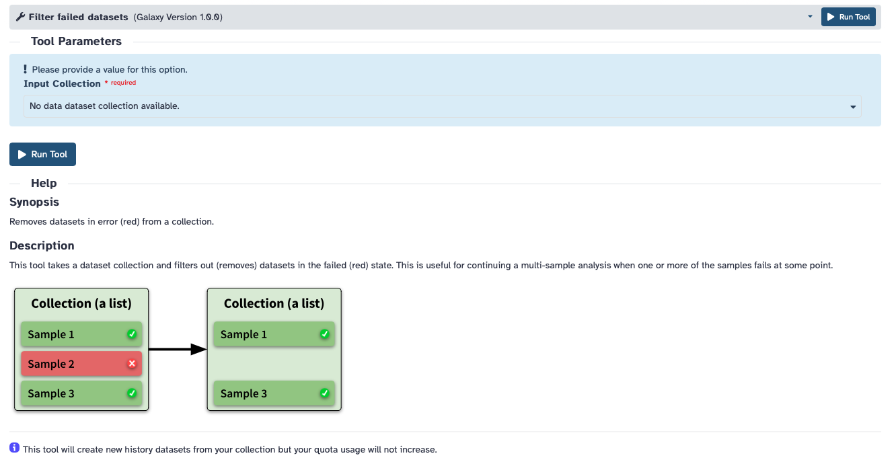

In Galaxy, users can effectively manage collections with failed samples using the [`Filter failed datasets`](http://v1259.nbi.ac.uk/root?tool_id=__FILTER_FAILED_DATASETS__) tool. This functionality allows for quick and easy removal of problematic samples, ensuring that only passed samples are used in next downstream analyses.

