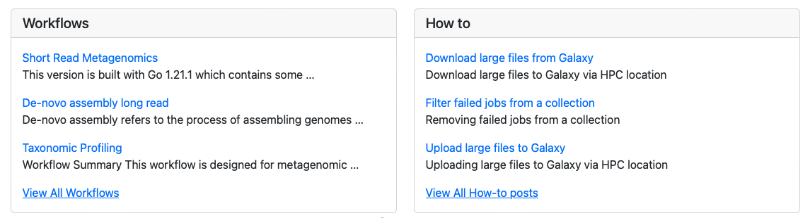

# Galaxy-Front-Page

This is the source code to build the [Galaxy-Front-Page](https://github.com/quadram-institute-bioscience/galaxy-front-page-html) based on [HUGO](https://gohugo.io/) and [hugo-bootstrap-templates](README.original.md).

## Contribution and Update

There are two sections might need to be updated: `workflows` and `how-to`. 

There are two folders that reside in the folder `galaxy-front-page/content`.

Essentially, each article is a folder containing an `index.md` and images if needed. Once you have finished the update, please create a new PR.
